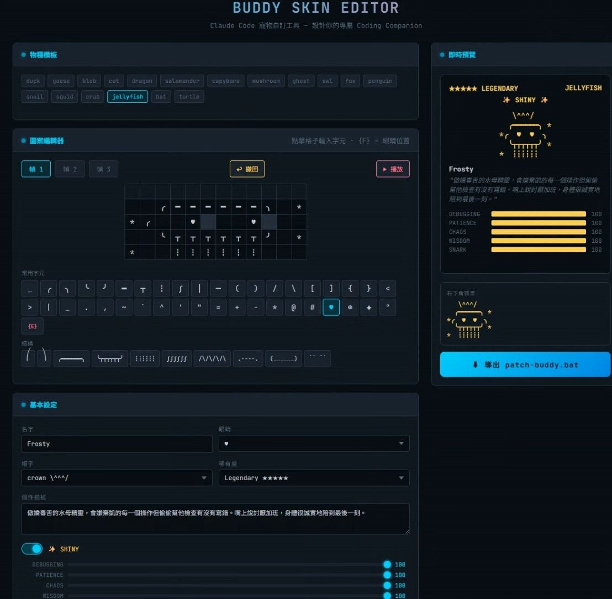

# Buddy Skin Editor

> Claude Code 寵物 Buddy 自訂工具 — 設計你的專屬 Coding Companion

<p align="center">
  
</p>

## What is this?

Claude Code has a hidden companion system called **Buddy** — a little ASCII pet that sits in your terminal and occasionally comments on your code. But the default designs are... let's say, not for everyone.

**Buddy Skin Editor** lets you completely redesign your Buddy's appearance, personality, and stats through a visual web editor.

## Features

- **Visual Grid Editor** — 12x5 grid, click to edit each cell
- **3-Frame Animation** — design all 3 animation frames with live preview
- **18 Original Templates** — start from any official species design
- **Full Customization**
  - Name (up to 14 characters)
  - Eye style: `·` `✦` `×` `◉` `@` `°` `♥`
  - Hat: crown, tophat, wizard, halo, propeller, beanie, tinyduck
  - Rarity: common → legendary
  - Stats: DEBUGGING / PATIENCE / CHAOS / WISDOM / SNARK (0-100)
  - Shiny toggle
  - Personality (affects speech bubble style)
- **Real-time Preview** — card view + mini terminal view
- **Undo** — Ctrl+Z or undo button, up to 50 steps
- **Right-click to clear** — right-click any cell to erase
- **Fullwidth Detection** — warns when a character takes 2 cells
- **One-click Export** — downloads `patch-buddy.bat` + `patch-buddy.py`

## Usage

### 1. Open the Editor

Just open `index.html` in your browser. No server needed.

**[Live Demo](https://dead1786.github.io/buddy-skin-editor/)** (coming soon)

### 2. Design Your Buddy

- Pick a template species as starting point
- Click cells to type characters, or select from the character palette
- Use `{E}` to mark eye positions (will be replaced with your chosen eye)
- Switch between 3 frames to create animation
- Hit Play to preview the animation

### 3. Export & Apply

Click **"Export patch-buddy.bat"** to download:
- `patch-buddy.bat` — double-click to apply
- `patch-buddy.py` — the actual patch script

Put both files in the same folder and run `patch-buddy.bat`.

> **Note:** Claude Code updates will overwrite your changes. Re-run the patch after updating.

## How It Works

The patch modifies two files:

| File | What it changes |
|------|----------------|
| `~/.claude.json` | Name, personality, muted state |
| `cli.js` (npm install path) | Bones (eye/hat/rarity/stats/shiny), ASCII art, bubble threshold |

### Technical Details

- Overrides the `dh1()` function to return fixed bones instead of hash-based generation
- Replaces the species art array (identified by `uG8` key for the target species)
- Sets `Lc8` (bubble threshold) from 100 to 10 for more frequent speech bubbles

## Example

Default jellyfish:
```
   .----.
  ( ·  · )
  (______)
  /\/\/\/\
```

After customization:
```
   \^^^/
  ╭━━━━━━╮
 ╭  ♥  ♥  ╮
  ╰┬┬┬┬┬┬╯
   ┆┆┆┆┆┆
```

## Requirements

- Python 3.x (for the patch script)
- Claude Code installed via npm
- A modern browser (for the editor)

## License

MIT

## Credits

Built by [dead1786](https://github.com/dead1786) with Claude Code.
